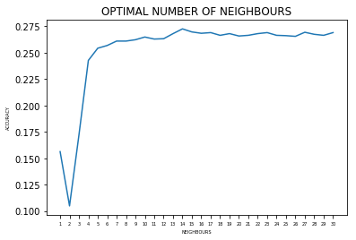

# DataTriumph. Market Basket Analysis Using Machine Learning.

<b>Team Members:</b> 
<ul>
<li><b>SK SAQLAIN MUSTAQ.</b></li>
<li><b>SUMAIR AHMED SHARIFF.</b></li>
</ul>
<b>The given repository was created as a part of 5th Semister Data Analaytics Project PESU.</b>

Market basket analysis is based upon the identification and analysis of purchasing patterns of the customers it helps in scientific decision support for retail market by mining association rules among items people purchased together. Mining purchasing patterns allows retailers to adjust promotions, store settings and serve consumers better.The process involves an analysis of historic data and based on that analysis to predict the future occurrences or events.In this paper we have proposed multiple model usig k-nn,SVM, MLP to test whether can supervised learning algorithmn can be used to recommend items to users and also implemented a model that would predict whether the item will be reordered or not, using logisticregression algorithm which was also testted witha NN model to check which model performed better and and also a recommending system that will recommend products to customer based on collaborative filtering and using the products which have been re-ordered multiple times that is high demand. 

 
 
<ul><li>HARDWARE REQUIREMENTS:-</li></ul>
<ul><li type=1>python3</li><li type=1>MINIMUM 18gb OF RAM</li></ul>
 
 
<ul><li>PROPOSED APPROACH:-</li></ul>
As most of the approaches uses Associative rules mining and Apriori based methods thus majority of the time is consumed in generating the rules.

<ul><li type='A'><b>Data processing:-</b></li> 

The transactions that were present in the dataset were in a single column and not in a basket format thus the dataset was processed to get all the items that is ordered by a single user/transaction, and in-order to model the problem with a supervised learning algorithms, each transaction was further processed, thus the code to processed the data is present data-processing.ipynb. 

 
<li type='A'><b>Recommending next items using supervised learning approach :-</b></li>
 <ul><li> k-nn:</li></ul>K nearest neighbors is a simple algorithm that stores all available cases and classifies new cases based on a similarity measure (e.g., distance functions). A k-nn model was trained with the above mentioned processed data to predict the next item in the transaction, the model was fit with the processed data distance measure being RMSE. The model was trained multiple times with varying neighbors and on testing against the testing data as shown in the Figure as it can be seen that an optimal number of neighbours being 14 with an accuracy of 27.2% and then the accuracy just drops and becomes saturated. 

  

The main disadvantage of the KNN algorithm is that it is a lazy learner that is it does not learn anything from the training data and simply uses the training data itself for classification,  the algorithm must compute the distance and sort all the training data at each prediction, which can be slow if there are a large number of training examples as in the case of instacart dataset . Another disadvantage of this approach is that the algorithm does not learn anything from the training data, which can result in the algorithm not generalizing well and also not being robust to noisy data. 
The code that implements using k-nn algorithm is present in the k-nn.ipynb

<ul><li> SVM:</li></ul> SVM is a supervised machine learning algorithm which can be used for classification or regression problems. It uses a technique called the kernel trick to transform the data and then based on these transformations it finds an optimal boundary between the possible outputs. .SVM is capable of finding non-linear boundaries among the data-points. The benefit is that it can capture much more complex relationships between data-points without having to perform difficult transformations on the data. A SVM model was also trained with the above mentioned processed data to predict the next item that is likely to be picked up, the model was trained on the training data with default parameters of SVM on testing it against the testing data the model predicted with an accuracy of 23.7%. 
The downside of the above mentioned model is that the training time is much longer as it’s much more computationally intensive.
The corresponding code is available in model2.ipynb
 
 
<ul><li> Multi-Layer Perceptron:</li></ul>A Neural Network model was trained with with 3 layers,layer-1 consisting of 50 neurons layer-2 consisting of 20 neurons and layer-3 consisting of 10 neurons activation function being relu and alpha learning rate being 0.001 with max iteration being 500 and optimizer being adam-optimiser. When the model was tested with the testing dataset an accuracy of 29% was obtained when the models parameter was further changed the models accuracy did not change but remained saturated.
The corresponding code is available in model2.ipynb
 

The below table summariezes the accuracy of the above three model.

The above three models were tested on the Bakery Dataset only, as due to the lack of hardware resources the model could not be applied to the instacart dataset which required enormous amount of memory and time to process the transaction and train the model. The neural network performed better as it is capable of learning complex patterns among the data-points compare to the other methods, but its accuracy can further be improved with further preprocessing of the data-set as mention in the above mentioned Data processing section and proper hardware resources.

</ul>
<ul><li type='A'><b>Predicting whether the item will be re-ordered or not :-</b></li>
 In order to predict whether the an item will be re-ordered or not the instacart dataset was used which had an additional information whether the product was re-ordered or not.
</ul>
